# Study Swarm Agent 🐝
### A Multi-Agent System for Personalized Learning


## 📖 Overview
**Study Swarm** is a multi-agent AI system designed to unify the fragmented study process. Instead of jumping between PDF textbooks, Google Search, and Python code editors, Study Swarm acts as a central **Study Manager** that coordinates specialized agents to help you learn faster.

This project was built for the **Kaggle 5-Day AI Agents Intensive Capstone**.

## 💡 The Problem
Students today face "Context Switching Fatigue." To understand a single complex topic, a student often has to:
1. Read a static PDF textbook (limited context).
2. Search Google for up-to-date definitions (distracting).
3. Write and run code to test the concept (manual setup).

These disjointed workflows break focus and lower retention.

## 🤖 The Solution
Study Swarm solves this by deploying a team of agents:
* **🧠 Study Manager (Core):** The orchestrator that understands the user's goal and delegates tasks.
* **📄 Doc Agent:** A specialist that indexes and retrieves information from uploaded PDFs (using RAG).
* **🔍 Search Agent:** A specialist grounded in Google Search to find real-time examples and facts.
* **💻 Code Agent:** A specialist that can write and execute Python code to demonstrate concepts practically.

## 🏗️ Architecture

```mermaid
graph TD
    User[User 🎓] -->|Input| UI[Streamlit UI 💻]
    UI -->|History + Query| Brain[Gemini 2.0 Context Manager 🧠]
    Brain -->|Rewritten Query| Router{Router 🔀}
    
    Router -->|Web Search| Search[Search Agent 🌐]
    Router -->|PDF Q&A| Doc[Doc Agent 📄]
    Router -->|Python Math| Code[Code Agent 🐍]
    Router -->|Video Analysis| Video[Video Agent 🎥]
    
    Search -->|Google Search| Tool1((Google Tool))
    Doc -->|RAG + OCR| Tool2((PDF Tool))
    Code -->|Execute| Tool3((Python Sandbox))
    Video -->|Multimodal| Tool4((Gemini Vision))
    
    Tool1 --> Search
    Tool2 --> Doc
    Tool3 --> Code
    Tool4 --> Video
    
    Search --> UI
    Doc --> UI
    Code --> UI
    Video --> UI
```



The system uses a **Hub-and-Spoke** architecture:
1.  **User** sends a prompt to the **Manager**.
2.  **Manager** analyzes intent and routes to the correct **Tool/Agent**.
3.  **Agents** return specific data (Context, Web Results, or Code Output).
4.  **Manager** synthesizes the final answer.

## 🛠️ Technologies
* **Python 3.10+**
* **Google Gen AI SDK (Gemini 2.0/1.5)**
* **PyMuPDF (Fitz):** For PDF text extraction.
* **DuckDuckGo/Google Search Tool:** For live web data.

## 🚀 Setup & Installation

1. **Clone the repository**
   ```bash
   git clone https://github.com/simonMakumi/kaggle-agent-study-swarm.git
   cd kaggle-agent-study-swarm
   ```

2. **Install Dependencies**
    ```bash
    python -m venv kaggle
    source kaggle/bin/activate  # On Windows: kaggle\Scripts\activate
    pip install -r requirements.txt
    ```

3. Set up API Keys Create a `.env` file in the root directory:
    ```bash
    GOOGLE_API_KEY=your_gemini_api_key
   ```

4. Run the Agent
    ```bash
    python main.py
    ```

## 📂 Project Structure
* `agents/`: Contains the logic for individual agents (Search, Doc, Code).

* `tools/`: Custom tools (PDF reader).

* `main.py`: The entry point for the Study Manager.


## ☁️ Deployment (Docker)
To deploy this agent to Google Cloud Run or any Docker-based host:

1. **Build the Container:**
   ```bash
   docker build -t study-swarm .
   ```
2. **Run the Container:**
    ```bash
    docker run -e GOOGLE_API_KEY=your_actual_key_here -it study-swarm
    ```